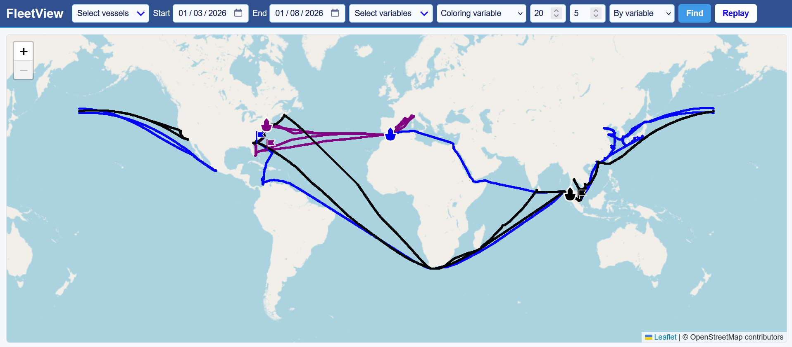
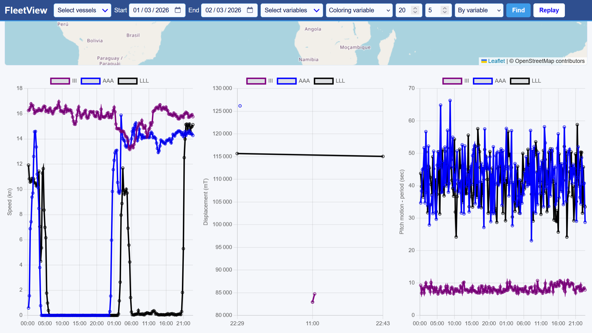
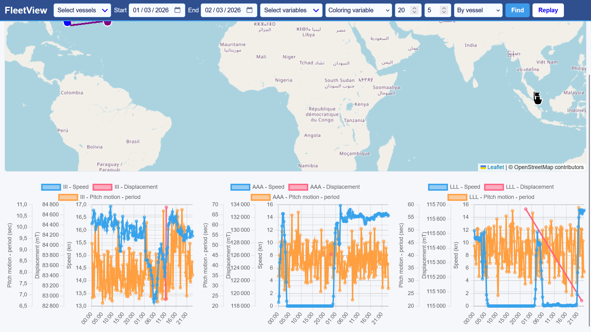
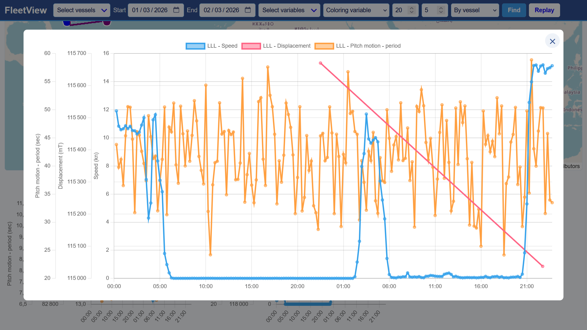
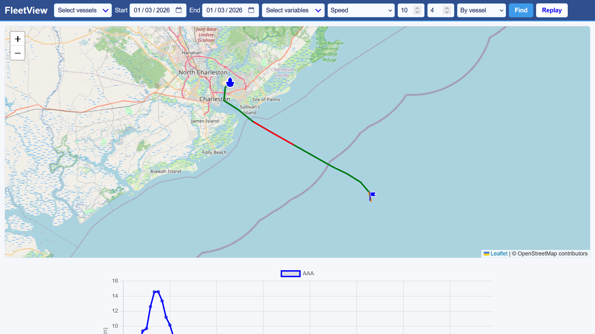
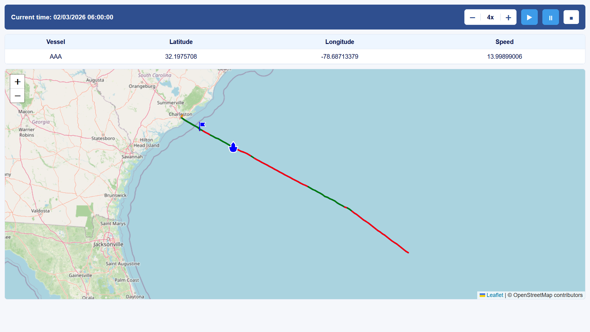
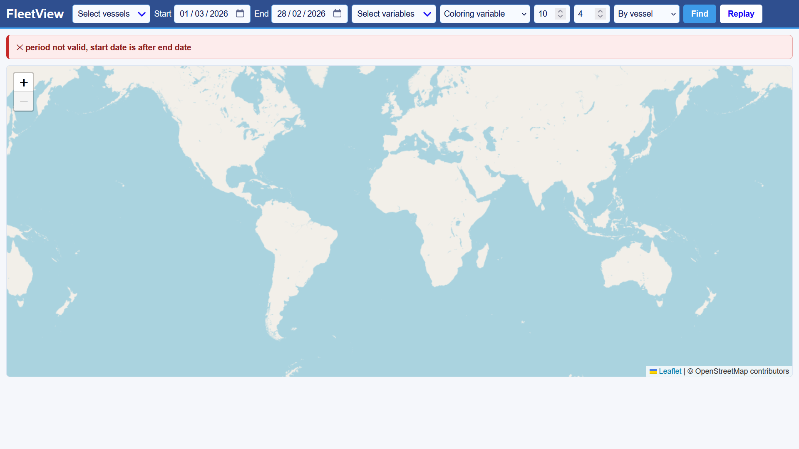

# FleetView

**Maritime fleet data visualization and historical replay**

FleetView is a web application built for a Full Stack Engineer technical assessment. It allows users to explore historical measurements for three vessels, compare their data over a selected period, inspect their trajectories on an interactive world map, and replay vessel activity over time.

The assessment describes a larger fleet-monitoring system of approximately 1,000 vessels. The application delivered here is a prototype based on the three vessels and the GPS, MOTIONS, and MACS3 datasets supplied for the test.

## Features

- **Data exploration:** select one or more vessels, a date range, and measurements from the available datasets.
- **Interactive map:** display historical tracks, distinguish vessels visually, show departure and vessel markers, and fit the map to the selected tracks. Trajectory coloring is optional and uses a selected measurement, reference value, and tolerance to display Low, Normal, and High states.
- **Time-series charts:** compare vessels or measurements, choose an organization by vessel or by variable when both selections are multiple, and expand a chart to inspect it.
- **Historical replay:** play or pause a selected period, change playback speed, inspect the current replay time and available measurements, and exit back to the exploration view.
- **Partial data handling:** retain available measurements when others are missing. Charts show gaps for missing GPS/MOTIONS observations; replay hides a vessel marker when its GPS position is unavailable. MACS3 records retain their own timestamps.
- **Error and warning handling:** distinguish request errors from warnings about unavailable or unrecognized selections.

## Screenshots

### Vessel trajectories

View the historical routes of the three vessels on the interactive world map.



### Data visualization

Compare selected measurements across vessels or group the charts by vessel.

**By variable**



**By vessel**



Expand a chart for a more detailed view.



### Trajectory coloring

Color route segments according to a selected measurement, reference value, and tolerance.



### Historical replay

Follow vessel positions over time and control playback speed.



### Error handling

The interface displays messages when a request has no selected vessel or an invalid date range.




## Technology

| Component | Technology |
|---|---|
| Backend and HTTP API | Python, Django, pandas |
| Frontend | HTML, CSS, vanilla JavaScript |
| Map | Leaflet, OpenStreetMap tiles |
| Charts | Chart.js, chartjs-adapter-date-fns |
| Prototype measurement storage | CSV files loaded into pandas DataFrames |

The backend provides three JSON endpoints:

| Endpoint | Purpose |
|---|---|
| `/api/vessels/` | Available vessels |
| `/api/variables/` | Available measurements and metadata |
| `/api/data/` | Data filtered by vessel, date range, and variable |

The prototype reads vessel measurements from CSV files. Django's local SQLite database is used for its standard framework components; vessel measurements are not stored in SQLite.

## Run locally

### Prerequisites

- Python compatible with the dependencies pinned in `backend/requirements.txt` (Python 3.12 is used for this project).
- An internet connection for frontend libraries and OpenStreetMap tiles.
- The CSV files supplied with the technical assessment; they are not included in the public repository.

### Setup

Clone the repository and create a virtual environment:

```bash
git clone https://github.com/mina2706/fleetview.git
cd fleetview
python -m venv .venv
```

Activate it on macOS or Linux:

```bash
source .venv/bin/activate
```

Or on Windows PowerShell:

```powershell
.venv\Scripts\Activate.ps1
```

Install dependencies:

```bash
python -m pip install -r backend/requirements.txt
```

Place the original CSV files in a `data/` directory at the repository root:

```text
fleetview/
├── backend/
│   ├── fleet/
│   ├── fleetview/
│   ├── manage.py
│   └── requirements.txt
└── data/
    └── ... supplied CSV files ...
```

Keep the supplied filenames and column headers: the loader identifies the vessel and data family from each filename and reads measurement metadata from its headers.

Start Django:

```bash
cd backend
python manage.py migrate
python manage.py runserver
```

Open **http://127.0.0.1:8000/api/index/** in your browser.

The CSV files are loaded when the Django process starts. Restart the server after changing them.

## How to use

1. Select the vessels, date range, and measurements to explore.
2. Optionally select a coloring measurement and enter a reference value and tolerance.
3. Click **Find** to display the map and charts.
4. Select **Replay** to inspect the selected period, control playback, and view the available vessel data at each step. Select **Exit** to return to the exploration view.

## Scope and next steps

This prototype demonstrates historical visualization for the supplied three-vessel dataset. It has not been load-tested for a fleet of 1,000 vessels. The application uses local CSV files rather than live maritime data APIs. Worldwide weather storage, persistent measurement storage, and waypoint editing are addressed as design requirements separately from the running prototype.

Further work would include larger-scale data access, stronger validation for additional data sources, improved chart navigation for long time ranges, and UI/UX improvements to make the interface more intuitive and user-friendly.