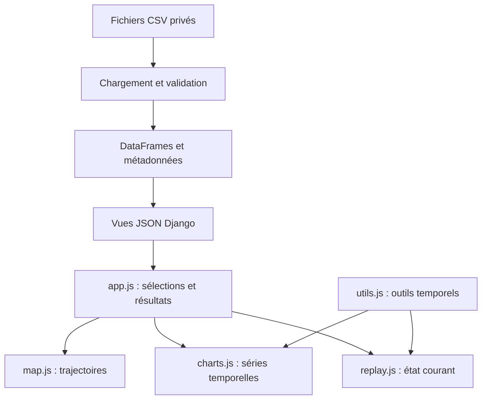

# FleetView — Documentation technique

Ce document présente l’architecture et le fonctionnement du prototype FleetView, développé à partir des jeux de données fournis dans le cadre du test technique. Il décrit les principales décisions de conception, leur mise en œuvre et les limites actuelles de l’application.

Les instructions d’installation et d’utilisation figurent dans le README.

## 1. Architecture du prototype

FleetView est une application Django qui sert une page HTML et trois points d’accès JSON. Au démarrage, `FleetConfig.ready()` charge les fichiers CSV du répertoire `data/`, situé à la racine du projet, avec pandas. Les DataFrames et les métadonnées sont conservés en mémoire dans l’objet `FleetConfig` afin d’être réutilisés par les vues Django. Les vues sélectionnent les observations correspondant aux navires, aux dates et aux variables demandés. Les mesures des navires ne sont stockées ni dans des modèles Django ni dans SQLite.



Le schéma représente le parcours des données et les principales responsabilités du frontend. **Find** utilise une timeline régulière pour les graphiques GPS/MOTIONS, avec des points `null` aux instants sans observation. **Replay** utilise une timeline régulière pour parcourir la période sélectionnée. Les deux fonctionnalités appellent la même fonction utilitaire de `utils.js`. Les graphiques MACS3 conservent les timestamps de leurs snapshots.

Le frontend utilise des fichiers JavaScript chargés directement par la page HTML. Certaines fonctions et variables sont partagées entre ces scripts, notamment les résultats de recherche réutilisés par le replay. `index.html` charge Leaflet 1.9.4, Chart.js et `chartjs-adapter-date-fns`, puis `utils.js`, `map.js`, `charts.js`, `replay.js`, `messages.js` et `app.js`. Leaflet, Chart.js et l’adaptateur temporel de Chart.js sont chargés depuis des CDN. La version de Leaflet est fixée à 1.9.4 ; celles de Chart.js et de son adaptateur ne sont pas explicitement fixées dans les URL utilisées. L’interface utilise du CSS personnalisé.

SQLite sert aux composants standard de Django. `models.py` ne définit aucun modèle de navire ni de mesure. Le parcours habituel consiste à effectuer une recherche **Find** réussie, puis à activer **Replay** et **Play** ; la lecture ne déclenche pas de deuxième requête de données.

Les DataFrames sont conservés dans la mémoire du processus Django qui a effectué le chargement. Un redémarrage du processus relance l’initialisation et la lecture des CSV ; les recherches Find successives utilisent les DataFrames déjà présents en mémoire. Les CSV modifiés sur disque ne sont donc pas relus pendant l’exécution de ce processus.

## 2. Structure du projet

Les chemins ci-dessous sont relatifs à la racine du dépôt.

| Chemin | Rôle |
|---|---|
| `data/` | CSV sources privés, fournis séparément et ignorés par Git. |
| `backend/manage.py` | Point d’entrée des commandes de gestion Django. |
| `backend/requirements.txt` | Versions des dépendances Python utilisées par le projet ; fichier encodé en UTF-16. |
| `backend/fleetview/settings.py` | Enregistrement de l’application, SQLite, fichiers statiques, paramètres de développement et politique de référent HTTP. |
| `backend/fleetview/urls.py` | Toutes les routes, dont `/api/index/` ; il n’y a pas de fichier `fleet/urls.py`. |
| `backend/fleet/apps.py` | Chargement des données et des métadonnées à l’initialisation. |
| `backend/fleet/data_loader.py` | Chargement des fichiers CSV et validation des données selon leur famille de dataset (GPS, MOTIONS ou MACS3). |
| `backend/fleet/utils.py` | Analyse des noms de fichiers, nettoyage des timestamps, contrôle des coordonnées et extraction des métadonnées. |
| `backend/fleet/views.py` | Catalogues, validation des requêtes, filtrage et réponses JSON ou HTML. |
| `backend/fleet/templates/fleet/index.html` | Barre de navigation, sélections, carte, graphiques, commandes et tableau du replay. |
| `backend/fleet/static/fleet/js/app.js` | Chargement des catalogues, Find, organisation des graphiques, sélection de la coloration, entrée dans Replay et Exit. |
| `backend/fleet/static/fleet/js/map.js` | Couches Leaflet, géométrie des segments, couleurs et marqueurs. |
| `backend/fleet/static/fleet/js/charts.js` | Configuration des graphiques, groupes d’axes, points et affichage agrandi. |
| `backend/fleet/static/fleet/js/replay.js` | État à un instant donné, minuteur, vitesse, mise à jour des marqueurs et du tableau. |
| `backend/fleet/static/fleet/js/utils.js` | Construction des timelines et formatage de l’affichage selon la convention UTC. |
| `backend/fleet/static/fleet/js/messages.js` | Affichage des erreurs et des avertissements. |
| `backend/fleet/static/fleet/css/style.css` | Mise en page, menus, carte, mode replay, grille et agrandissement des graphiques. |
| `backend/fleet/tests.py` | Fichier de test généré par défaut, sans tests implémentés. |
| `backend/fleet/models.py`, `admin.py`, `migrations/` | Structure de base Django, sans schéma de stockage des mesures. |

Les deux fichiers `utils` remplissent des fonctions différentes : le fichier Python prépare les données ; le fichier JavaScript gère le temps pour leur représentation. Aucun des deux ne constitue une couche d’accès à une base de données.

## 3. Chargement et traitement des données

### 3.1 Données fournies

Les données fournies comprennent neuf fichiers CSV : trois familles de données pour chacun des trois navires. Les CSV restent privés et sont exclus du dépôt public.

| Navire | Famille | Lignes | Premier timestamp | Dernier timestamp |
|---|---|---:|---|---|
| AAA | GPS | 14 779 | 2026-03-01 00:15:00 | 2026-08-01 23:45:00 |
| AAA | MOTIONS | 14 778 | 2026-03-01 00:15:00 | 2026-08-01 23:45:00 |
| AAA | MACS3 | 155 | 2026-03-01 23:58:38 | 2026-08-01 08:12:04 |
| III | GPS | 14 436 | 2026-03-01 00:15:00 | 2026-08-01 23:45:00 |
| III | MOTIONS | 14 436 | 2026-03-01 00:15:00 | 2026-08-01 23:45:00 |
| III | MACS3 | 78 | 2026-03-02 12:00:37 | 2026-08-01 11:43:11 |
| LLL | GPS | 14 235 | 2026-03-01 00:15:00 | 2026-08-01 23:45:00 |
| LLL | MOTIONS | 13 546 | 2026-03-01 00:15:00 | 2026-08-01 23:45:00 |
| LLL | MACS3 | 116 | 2026-03-01 23:29:58 | 2026-08-01 01:16:21 |

L’énoncé du test évoque dix mois et utilise les identifiants génériques IMO1/IMO2/IMO3. Les fichiers réellement fournis couvrent environ cinq mois et utilisent AAA/III/LLL. Aucune correspondance avec de véritables numéros IMO n’est établie.

Les neuf fichiers fournis contiennent des valeurs `Timestamp` valides, qui peuvent être converties en dates par pandas. Aucun timestamp dupliqué n’a été relevé à l’intérieur d’un même fichier.

Dans les fichiers GPS et MOTIONS fournis, les observations présentes correspondent à des instants situés sur une grille de 15 minutes. Le traitement des CSV ne vérifie toutefois pas qu’un nouveau fichier respecte cette fréquence : une observation horodatée, par exemple, à 10:17 n’est pas rejetée pour cette seule raison.

Les séries GPS et MOTIONS présentent des observations manquantes. Pour chaque fichier, une interruption est comptabilisée lorsque l’écart entre deux timestamps consécutifs dépasse 15 minutes. Le nombre d’interruptions observées est de 3 dans GPS et 4 dans MOTIONS pour AAA, de 11 dans chacune des deux familles de dataset pour III, puis de 12 dans GPS et 14 dans MOTIONS pour LLL. Une interruption peut correspondre à plusieurs observations manquantes. Ces décomptes décrivent chaque fichier séparément et n’impliquent pas que les absences GPS et MOTIONS surviennent aux mêmes instants.

GPS comporte cinq mesures : Course, Heading, Latitude, Longitude et Speed. MOTIONS comporte 25 colonnes de mesures : cinq champs relatifs au roulis paramétrique et vingt champs de mouvement, accélération, vitesse ou période. MACS3 comporte 15 colonnes de mesures, dont Displacement, FSM, GG, GM, GMFluid, Kg, Lcg, Rxx/Ryy/Rzz, TAft/TFwd, TPitch/TRoll et Tcg. Les unités présentes dans les en-têtes sont conservées telles quelles ; l’interprétation physique complète de chaque champ nécessiterait la documentation du fournisseur.

Dans GPS pour AAA, Course, Latitude, Longitude et Speed sont manquants le 19 juin à 02:45 et à 03:00, tandis que Heading reste présent. GPS pour LLL comporte trois valeurs Heading manquantes. MOTIONS comporte des champs partiellement manquants pour chaque navire. Les timestamps MACS3 sont irréguliers : l’intervalle maximal observé est de 16 jours, 1 heure, 8 minutes et 28 secondes pour III. Cela ne suffit ni à établir une défaillance ni à définir une durée de validité admissible.

### 3.2 Découverte des fichiers et métadonnées

`find_files()` utilise un `glob("*.csv")` non récursif. `extract_file_info()` récupère le nom du fichier sans extension, lit la partie située après son dernier underscore, puis la décompose en identifiant du navire et famille de données. Ainsi, `2026-08-25 16_28_15_AAA GPS.csv` donne `AAA`, `GPS`. La faute connue `MASC3` est normalisée en `MACS3` ; le fichier original n’est pas renommé.

Le chargeur lit chaque fichier avec `pd.read_csv()`. Avant de remplacer les noms de colonnes, il extrait leur en-tête brut, l’unité entre crochets et la source entre parenthèses. Les espaces autour du nom normalisé sont supprimés ; `[-]` signifie qu’aucune unité n’est renseignée. `summarize_metadata()` conserve les variantes distinctes et non nulles sous forme de listes. Dans le catalogue commun, une unité ou une source absente est représentée par une liste vide.

Par exemple, Speed est mesurée en `kn`, avec la source `NAVIGATION` pour III et `NAVIGATION_GPS` pour AAA/LLL. L’extraction des métadonnées précède le renommage des colonnes. Le catalogue commun rassemble les variantes observées dans les fichiers fournis ; lors d’une requête, la présence effective des colonnes est vérifiée séparément pour chaque navire. Le chargement ne convertit pas les valeurs numériques entre unités. La normalisation des en-têtes permet de séparer le nom d’une variable, son unité et sa source, puis de supprimer les espaces inutiles autour de son nom. Elle ne corrige cependant pas automatiquement les différences d’orthographe, de casse ou de dénomination entre colonnes. Par exemple, `Speed`, `speed` et `SPEED` ne sont pas automatiquement considérés comme une même variable. De même, la colonne temporelle doit être nommée exactement `Timestamp` : des variantes telles que `timestamp`, `TimeStamp`, `TIMESTAMP` ou `timestamps` ne correspondent pas au nom attendu.

### 3.3 Chaîne de validation

Chaque famille doit posséder une colonne `Timestamp`. `clean_timestamps()` copie le DataFrame, convertit les dates invalides en `NaT`, supprime les lignes correspondantes, trie les données dans l’ordre chronologique et réinitialise l’index. Sa deuxième valeur de retour est un **nombre de lignes**, et non un booléen.

Pour GPS, `validate_position()` neutralise séparément les latitudes ou longitudes hors limites tout en conservant la ligne. Une position valide exige les deux coordonnées sur la même ligne. Le dataset reste exploitable s’il contient au moins une position valide **ou** au moins une valeur non nulle de Course, Heading ou Speed.

MOTIONS et MACS3 exigent au moins un timestamp valide et une valeur non nulle dans une colonne autre que `Timestamp`. La validation détermine si chaque famille de dataset contient des données exploitables. Une famille acceptée est conservée sous forme de DataFrame ; une famille rejetée est représentée par `None`. Le chargement enregistre ce résultat sous `data[vessel][dataset_type]`.

Le traitement des CSV distingue les valeurs manquantes à l’intérieur d’un dataset et le rejet d’une famille de dataset entière. Un dataset peut être conservé lorsqu’il contient encore des mesures exploitables malgré certaines valeurs manquantes. Par exemple, une ligne GPS dépourvue de coordonnées valides peut être conservée si elle contient une autre mesure exploitable, telle que Heading ou Speed.

En revanche, lorsqu’une famille de dataset ne satisfait pas les critères minimaux de validation, elle est représentée par `None` plutôt que par un DataFrame. Les vues Django ne prennent pas encore systématiquement en charge ce second cas et peuvent rencontrer une erreur si elles tentent de manipuler `None` comme un DataFrame.

**Hypothèses de traitement des fichiers CSV.** Le chargement est organisé autour des neuf fichiers fournis, avec un fichier par navire et par famille de dataset. Les données sont conservées dans un dictionnaire indexé par navire et par famille. Si plusieurs fichiers correspondent au même couple, ils ne sont pas fusionnés : une nouvelle entrée remplace la précédente.

Le traitement vérifie les éléments nécessaires à l’exploitation des fichiers fournis, notamment les timestamps, les coordonnées GPS et la présence de mesures utilisables. Il ne comprend pas de procédure générale de suppression des timestamps dupliqués, de contrôle des plages numériques de toutes les variables ou de résolution des collisions entre noms de colonnes normalisés. Le chargement n’impose pas non plus une fréquence de 15 minutes aux observations.

Enfin, la lecture des CSV ne prévoit pas de mécanisme général permettant d’isoler chaque fichier présentant une erreur de lecture ou de structure et de poursuivre systématiquement le chargement des autres fichiers.

## 4. Backend et API

### 4.1 Routes et format des requêtes

| Route | Réponse |
|---|---|
| `/api/index/` | Affiche `fleet/index.html`. La racine `/` ne possède aucune route applicative. |
| `/api/vessels/` | `{"vessels": ["AAA", "III", "LLL"]}` ; l’ordre dépend des clés chargées et n’est pas garanti. |
| `/api/variables/` | `{"variables": common_metadata}`. |
| `/api/data/` | `response`, `replay_context` et `warnings`, ou une `error` bloquante. |

La vue de données lit les paramètres de requête répétés avec `request.GET.getlist()`. Chaque valeur doit être passée séparément, plutôt que sous forme de liste séparée par des virgules :

```text
/api/data/?vessels=AAA&vessels=III&variables=Speed&variables=Roll+motion&start_date=2026-04-01&end_date=2026-04-02
```

Les points d’accès de FleetView utilisent des requêtes GET pour consulter les navires disponibles, les variables et les mesures filtrées. Le prototype ne comprend pas de point d’accès permettant de modifier ces mesures.

### 4.2 Validation et résultats partiels

| Situation | Comportement |
|---|---|
| Aucun paramètre de navire | HTTP 400, `no vessels in the request`. |
| Tous les navires demandés sont inconnus | HTTP 400, `no valid vessels`. |
| Dates absentes ou invalides | HTTP 400 avec une erreur de période. |
| Date de début postérieure à la date de fin | HTTP 400 avec une erreur d’ordre des dates. |
| Mélange de navires connus et inconnus | Les navires valides sont conservés ; les identifiants inconnus figurent dans les avertissements. |
| Nom de variable inconnu | Figure dans `unknown_variables` ; les données exploitables restent accessibles. |
| Variable connue globalement mais absente des données d’un navire sélectionné | La variable est indiquée pour ce navire dans `not_available_variables`. Les autres données disponibles peuvent être retournées. |
| Aucune variable demandée | Les coordonnées GPS et les timestamps restent disponibles lorsqu’ils existent dans les colonnes. |
| Période valide ne contenant aucune ligne | HTTP 200 avec des listes d’enregistrements vides ; aucun avertissement dédié aux périodes vides. |

La disponibilité d’une variable est déterminée à partir des familles de dataset et des colonnes présentes pour chaque navire. Elle est distincte de la disponibilité des valeurs à un instant donné : une variable peut être proposée à la consultation tout en comportant des observations manquantes pendant la période sélectionnée.

Le formulaire transmet les dates au format `YYYY-MM-DD`. Le backend les convertit en valeurs temporelles, puis les compare à la partie date des timestamps des DataFrames (`Timestamp.dt.date`). Les deux bornes sont incluses dans le filtrage afin de conserver toutes les observations de la première et de la dernière journée sélectionnées.

### 4.3 Structure de la réponse

Exemple illustratif abrégé : les valeurs suivantes montrent la structure attendue et ne proviennent pas d’une requête capturée. Les points de suspension signalent des enregistrements et des colonnes omis uniquement pour alléger l’exemple ; ils ne font pas partie de la réponse JSON réelle.

```text
{
  "response": {
    "AAA": {
      "GPS": [
        {"Timestamp": "2026-04-01T00:00:00", "Longitude": 1.0,
         "Latitude": 2.0, "Speed": null}
      ]
    }
  },
  "replay_context": {
    "AAA": [
      {"Timestamp": "2026-03-31T12:00:00", "GM": 3.0, ...},
      {"Timestamp": "2026-04-02T15:00:00", "GM": 3.2, ...},
      ...
      {"Timestamp": "2026-05-04T09:00:00", "GM": 3.1, ...}
    ]
  },
  "warnings": {
    "unknown_vessels": [],
    "unknown_variables": [],
    "not_available_variables": {"AAA": []}
  }
}
```

`response` contient les lignes filtrées par période et les colonnes demandées, ainsi que les coordonnées GPS lorsqu’elles sont présentes. Une famille dont seule la colonne Timestamp est sélectionnée est omise. Le contexte MACS3 comprend **toutes ses lignes et toutes ses colonnes** : il n’est limité ni aux champs sélectionnés ni au dernier enregistrement précédant la période. Il est également préparé lorsqu’aucune variable MACS3 n’a été demandée. Le replay utilise ce contexte pour retrouver des snapshots antérieurs à la période sélectionnée.

Avant leur conversion en listes de dictionnaires, les enregistrements ordinaires et le contexte MACS3 utilisent `astype(object).where(...notna(), None)`. Les valeurs manquantes sont ainsi représentées par `null` dans le JSON, sans modifier les DataFrames conservés en mémoire.

## 5. Implémentation du frontend

### 5.1 Find et état des sélections

Lorsque le DOM est prêt, `loadVessels()` et `loadVariables()` récupèrent les catalogues des navires et des variables depuis l’API pour construire les cases à cocher. Les variables sont regroupées par famille de dataset ; `Timestamp`, `Latitude` et `Longitude` ne sont pas proposés dans le sélecteur de mesures.

Lors d’un clic sur **Find**, `app.js` efface les anciennes couches de résultats de la carte, lit les navires, dates et variables choisis, puis construit la requête avec `URLSearchParams`. Après réception de la réponse JSON, une erreur HTTP interrompt le traitement et déclenche `showError()`. En cas de succès, `showWarnings()` affiche les éventuels avertissements, les graphiques sont reconstruits sur la période sélectionnée et `displayMap()` dessine les trajectoires. Le conteneur des graphiques est vidé **une seule fois avant leur création** ; tous les graphiques de la nouvelle recherche sont ensuite ajoutés.

Les résultats de la dernière recherche ainsi que les navires, les dates et les variables sélectionnés sont conservés dans des **variables globales JavaScript**. Les différentes fonctionnalités du frontend, notamment la carte, les graphiques et le replay, peuvent ainsi accéder aux données et aux paramètres nécessaires à leur fonctionnement.

Le menu de coloration est construit à partir des variables sélectionnées dans Find. Les variables MACS3 ne sont pas proposées comme mesures pilotes de coloration. L’option initiale « Coloring variable », dont la valeur est vide, permet de conserver la couleur propre à chaque navire sans appliquer de coloration supplémentaire. Les champs de référence et de tolérance sont d’abord lus comme des chaînes : une saisie de `0` reste ainsi distincte d’un champ vide avant la conversion numérique.

### 5.2 Carte et coloration

Leaflet affiche un fond OpenStreetMap avec attribution, dont les tuiles peuvent se répéter horizontalement pour accompagner le tracé des trajectoires mondiales. La carte est initialisée avec un zoom minimal de 2 et des limites géographiques étendues. Les tracés et les marqueurs créés lors d’une recherche sont regroupés dans `resultLayers` : le nettoyage de ce groupe supprime les anciens résultats sans retirer le fond de carte.

Pour chaque navire, `displayMap()` construit les positions `[latitude, longitude]` dans l’ordre des observations GPS. Lorsqu’une coloration est demandée, chaque position GPS est associée à la valeur de la variable pilote possédant **exactement le même timestamp**. Cette recherche est réalisée avec `.find()`. Si aucune mesure correspondante n’est disponible, sa valeur est représentée par `null`.

Les tableaux `gpsPositions`, `pilotValues` et `statuses` suivent le même ordre que les observations GPS. Un même indice correspond ainsi à une position, à sa mesure pilote et au statut calculé pour cet instant. Lorsqu’une mesure manque, le tableau conserve `null` à l’indice de la position GPS concernée.

La coloration repose sur une valeur de référence et une tolérance renseignées par l’utilisateur. Pour une référence `r`, une tolérance `t` et une mesure `x`, les statuts et couleurs sont les suivants :

| Statut | Condition | Couleur de la surcouche |
|---|---|---|
| Low | `x < r - t` | Orange |
| Normal | `r - t <= x <= r + t` | Vert |
| High | `x > r + t` | Rouge |
| Indisponible | `null` ou aucune mesure alignée | Pas de surcouche : la couleur du navire reste visible. |

Chaque segment de trajectoire est coloré selon le statut de la mesure pilote associée à **sa position de départ**. La couleur de base identifie le navire : bleu pour AAA, violet pour III et noir pour LLL. La surcouche orange, verte ou rouge représente le résultat de la comparaison avec la référence et la tolérance choisies. Si la mesure pilote est absente, le segment conserve la couleur de base du navire.

Les segments sont tracés entre deux positions GPS successives lorsque leurs latitudes et longitudes sont disponibles. Lors du passage de l’antiméridien, `displayMap()` ajuste sur une copie la longitude de la deuxième position de ±360° lorsque l’écart dépasse 180°. Par exemple, un passage de 179° à −179° est dessiné de 179° à 181°. Les coordonnées GPS d’origine ne sont pas modifiées.

Les marqueurs sont réalisés à l’aide de SVG intégrés dans des `L.divIcon`. Pour chaque navire, un drapeau indique la position du premier enregistrement GPS de la période et une icône de navire celle du dernier. Cette icône est ensuite réutilisée pour représenter la position courante pendant le replay. L’identifiant du navire apparaît au survol. Les positions GPS valides des navires sélectionnés sont rassemblées dans `allPositions`, puis Leaflet utilise `fitBounds()` pour adapter le cadrage de la carte aux trajectoires affichées, avec un zoom maximal de 10.

### 5.3 Graphiques

Le nombre de navires et de variables détermine l’organisation des courbes. Une seule variable sélectionnée produit un graphique avec une courbe par navire ; plusieurs variables pour un seul navire partagent un graphique. Lorsque plusieurs navires et plusieurs variables sont sélectionnés, l’utilisateur peut choisir **By variable** ou **By vessel**. Sans variable sélectionnée, aucun graphique n’est créé.

`buildChartPoints()` prépare les points `{x, y}` transmis à Chart.js. Pour GPS et MOTIONS, la fonction parcourt la timeline régulière de 15 minutes et les observations triées à l’aide d’un indice `j`. Lorsque les timestamps correspondent, elle ajoute la valeur de la mesure et passe à l’observation suivante. Lorsqu’aucune observation ne correspond à l’instant attendu, elle ajoute un point dont la valeur est `null`, y compris lorsque les observations manquent en fin de période. Ces points supplémentaires servent uniquement à l’affichage : ils ne sont pas ajoutés aux DataFrames sources.

Les mesures MACS3 sont affichées à leurs timestamps irréguliers d’origine, sans les aligner sur la grille de 15 minutes utilisée pour GPS et MOTIONS. Chaque snapshot fournit directement un point à Chart.js, qui affiche la série sous forme de courbe linéaire.

Lorsqu’un graphique contient plusieurs variables pour un même navire, `getVariableAxisGroup()` détermine quelles courbes peuvent partager un axe Y. Le regroupement s’appuie d’abord sur la **famille de dataset et l’unité de mesure**. Par exemple, Course et Heading peuvent partager un axe GPS en degrés, tandis que Speed, exprimée en nœuds, utilise un autre axe. Une variable MOTIONS exprimée en degrés reste sur un axe distinct de celui des mesures GPS. Si l’unité n’est pas renseignée, le regroupement utilise la famille de dataset et la source ; si la source est également absente, le nom de la variable sert à constituer le groupe. Les titres des axes indiquent les variables associées.

**NB —** Lorsque plusieurs unités ou sources sont recensées dans les métadonnées d’une même variable, le prototype utilise la première variante disponible pour constituer son groupe d’axe. Les valeurs numériques ne sont pas converties.

Les graphiques utilisent une échelle temporelle Chart.js avec des graduations issues des données (`source: "data"`). Les options `autoSkip` et `maxTicksLimit: 10` limitent l’encombrement des libellés, sans limiter le nombre d’observations de la courbe. Deux fonctions de formatage complètent cet affichage : `formatUtcTick()` adapte les graduations à l’unité temporelle retenue par Chart.js (heure, jour, mois ou année), et `formatUtcTooltip()` présente les dates dans les infobulles. Le formatage actuel utilise UTC comme convention d’affichage.

**NB —** La fonction de formatage `formatUtcTick()` utilisée actuellement a été écrite avec l’assistance d’une IA puis intégrée au prototype. Elle reçoit notamment l’unité temporelle via la propriété interne `_unit` de Chart.js.

`createChart()` crée le conteneur, le `canvas`, le bouton de fermeture et l’instance Chart.js. Un clic agrandit le graphique dans la page ; le bouton × rétablit son affichage initial sans réactiver l’agrandissement. La grille comporte trois colonnes par défaut, deux lorsque deux graphiques sont générés et un seul graphique centré jusqu’à 850 px lorsqu’il n’y en a qu’un.

### 5.4 Messages et avertissements

FleetView distingue les **erreurs bloquantes**, qui empêchent de traiter une recherche, des **avertissements**, qui accompagnent une réponse partiellement exploitable. Lorsqu’une recherche échoue, `showError()` affiche le message retourné par l’API. Lorsqu’elle réussit avec des avertissements, `showWarnings()` présente les navires inconnus, les variables inconnues et les variables indisponibles pour certains navires. Les données exploitables peuvent ainsi rester accessibles.

Les deux fonctions remplacent les messages précédents afin que la zone de notification corresponde au résultat de la dernière recherche. Elles insèrent les libellés avec `textContent`, qui les affiche comme du texte plutôt que de les interpréter comme du HTML.

## 6. Replay historique

Le replay historique permet de suivre l’évolution des navires sur la période sélectionnée. Il affiche leur position sur la carte ainsi qu’un tableau présentant les mesures disponibles à l’instant de lecture. Les commandes Replay, Play, Pause et les réglages de vitesse permettent de parcourir cet historique par étapes de 15 minutes.

### 6.1 Convention temporelle

Les timestamps des CSV ne précisent pas leur fuseau horaire d’origine. Pour parcourir la période sélectionnée, `createTimeline()` construit une liste d’instants espacés de 15 minutes en utilisant UTC comme convention de calcul. Elle commence à 00:00 le premier jour et s’arrête avant 00:00 le lendemain du dernier jour : chaque journée de la période est ainsi parcourue de 00:00 à 23:45.

À chaque étape, `getVesselDataAtTime()` compare l’instant du replay aux timestamps GPS et MOTIONS pour retrouver les observations correspondant exactement à l’heure affichée. Pour MACS3, elle recherche le dernier snapshot disponible à cet instant ou avant celui-ci. Lors de ces recherches, les timestamps reçus du backend sont convertis selon la même convention UTC que les instants de la timeline. Le code ajoute pour cela `Z` à la chaîne du timestamp au moment de sa conversion en date JavaScript : une valeur telle que `2026-04-01T10:15:00` est alors interprétée comme `2026-04-01T10:15:00Z` pour la comparaison, sans modifier la valeur enregistrée dans les données.

La convention UTC utilisée par le programme ne renseigne pas le fuseau dans lequel les mesures ont réellement été collectées. L’heure courante du replay est affichée en français avec UTC. La date de dernière mise à jour MACS3 est présentée dans le tableau sous la forme de la chaîne reçue du backend.

### 6.2 État à un instant du replay

`getVesselDataAtTime()` reconstitue l’état d’un navire pour l’instant traité. Elle renvoie sa position, les valeurs des variables sélectionnées et, lorsqu’une mesure MACS3 est utilisée, le timestamp du snapshot correspondant. Exemple illustratif de la structure renvoyée :

```json
{
  "position": null,
  "values": {"Speed": null, "GM": 3.0},
  "macs3Timestamp": "2026-03-31T12:00:00"
}
```

Pour GPS et MOTIONS, les observations sont recherchées par correspondance exacte avec l’instant courant du replay. Lorsqu’aucune mesure n’est disponible à cet instant, sa valeur reste `null`. Une position GPS manquante n’est pas remplacée par la position précédente.

Pour MACS3, `getVesselDataAtTime()` utilise l’historique transmis dans `replay_context`, décrit dans la partie 4.3. La fonction recherche le dernier snapshot dont le timestamp est antérieur ou égal à l’instant courant du replay. Le snapshot retrouvé peut être antérieur au début de la période sélectionnée.

Si aucun snapshot antérieur n’est disponible, les valeurs MACS3 restent `null`. Lorsqu’un champ est manquant dans le dernier snapshot trouvé, il reste également `null` : le programme ne le complète pas à partir d’un snapshot plus ancien. Le timestamp du snapshot utilisé est conservé et affiché dans le tableau de replay.

### 6.3 Commandes et déroulement de la lecture

Lorsque l’utilisateur clique sur Play, un minuteur appelle régulièrement `runReplayTick()`. À chaque appel, cette fonction actualise l’état des navires pour un nouvel instant de la période sélectionnée.

| Action ou étape | Fonctionnement |
|---|---|
| Replay | Réinitialise la progression, construit la timeline et prépare les colonnes du tableau ; le premier instant sera affiché lors de la lecture. |
| Play | Démarre la lecture si aucun minuteur n’est actif. |
| Chaque étape de lecture — `runReplayTick()` | Actualise l’heure affichée, le tableau et les positions des navires, puis fait avancer la lecture à l’instant suivant. |
| Pause | Arrête le minuteur et conserve la progression pour la reprise. |
| Vitesse − / + | Modifie le délai réel entre les étapes de lecture : 0,5×, 1×, 2×, 4× ou 8×. |
| Fin de la période | Arrête automatiquement le minuteur après le dernier instant. |
| Exit | Arrête le replay, rétablit la vitesse initiale, vide le tableau et restaure l’interface ainsi que la carte statique. |

À 1×, une seconde réelle correspond à une progression de 15 minutes dans l’historique. Les réglages de vitesse modifient le délai réel entre deux étapes, sans changer ce pas historique. Lorsque le replay est en cours, le minuteur est recréé avec le nouveau délai. Si la lecture est en pause, le réglage est conservé et prend effet au prochain Play.

La progression est suivie par l’indice `i`, qui désigne le **prochain** instant à traiter dans la timeline. À la fin de chaque étape, `i` avance : si l’écran affiche 10:15 au moment d’une pause, la prochaine reprise affichera 10:30. Pause arrête le minuteur sans effacer l’état affiché ; `replayInterval` est remis à `null` pour indiquer qu’aucun minuteur n’est actif et permettre à Play d’en créer un nouveau. À la fin de la période, un nouvel appui sur Replay réinitialise la progression pour recommencer depuis le début.

`runReplayTick()` réutilise les marqueurs de navires créés par `displayMap()`. À chaque étape, elle déplace un marqueur vers la position GPS correspondante ou le masque si les coordonnées nécessaires ne sont pas disponibles. Le tableau présente une ligne d’état courant par navire et affiche un tiret pour les mesures absentes. Lorsqu’une variable MACS3 est sélectionnée, une colonne supplémentaire indique le timestamp du dernier snapshot utilisé.

Le mode replay masque la barre de navigation, les messages et les graphiques pour conserver la carte, les commandes de lecture et le tableau d’état des navires.

## 7. Référence des fonctions et des structures de données

Cette section sert de repère pour retrouver les principales fonctions et structures dans le code de FleetView. Pour chaque fonction, elle précise les informations reçues, son rôle dans l’application et ce qu’elle renvoie ou modifie. Les sections précédentes détaillent le déroulement du chargement, de Find, de l’affichage et du replay.

### 7.1 Fonctions Python

| Fonction | Entrées | Rôle dans FleetView | Résultat ou élément modifié |
|---|---|---|---|
| `FleetConfig.ready(self)` | Instance de la configuration de l’application Django (`self`). | Initialise les données au démarrage de Django en appelant `load_all_data()` sur le dossier `data/` du projet. Elle conserve ensuite les données et les métadonnées dans la configuration de l’application pour que les vues puissent y accéder sans relire les CSV à chaque recherche. | Renseigne `self.data` et `self.common_metadata`. |
| `load_all_data(data_path)` | Chemin (`Path`) du dossier contenant les CSV. | Parcourt les fichiers CSV, identifie le navire et la famille de chacun, extrait les métadonnées avant de normaliser les en-têtes, puis applique le traitement GPS ou MOTIONS/MACS3 approprié. | Retourne les données organisées par navire et famille (`data`) ainsi que le catalogue commun des variables (`common_metadata`). |
| `process_gps_data(df)` | DataFrame d’un fichier **GPS**, avec ses en-têtes déjà normalisés. | Nettoie les timestamps du fichier GPS, contrôle ses latitudes et longitudes, puis vérifie qu’il reste au moins une position valide ou une mesure disponible parmi Course, Heading et Speed. | DataFrame GPS préparé si le dataset est exploitable ; sinon `None`. |
| `process_motion_macs3_data(df)` | DataFrame d’un fichier **MOTIONS ou MACS3**, avec ses en-têtes déjà normalisés. | Nettoie les timestamps puis vérifie qu’il reste au moins une mesure non manquante dans une colonne autre que `Timestamp`. Le même traitement convient aux deux familles, qui ne nécessitent pas le contrôle des coordonnées GPS. | DataFrame MOTIONS ou MACS3 préparé si le dataset est exploitable ; sinon `None`. |
| `extract_file_info(file_name)` | Chemin du fichier CSV (`Path`) transmis par `load_all_data()` ; le nom du paramètre dans le code est `file_name`. | Extrait le nom du fichier à partir de son chemin, puis en déduit le navire et la famille de dataset. Par exemple, `2026-08-25 16_28_15_AAA GPS.csv` permet d’identifier AAA et GPS ; la variante `MASC3` est normalisée en `MACS3`. | Identifiant du navire et famille de dataset : `(vessel, dataset_type)`. |
| `find_files(folder_path)` | Chemin (`Path`) du dossier à parcourir. | Recherche les fichiers `.csv` présents dans ce dossier pour que `load_all_data()` puisse les lire et les traiter. | Liste des chemins des CSV trouvés. |
| `clean_timestamps(df, column)` | DataFrame à traiter et nom de sa colonne temporelle, ici `Timestamp`. | Convertit les valeurs temporelles en dates pandas, retire les lignes dont le timestamp est invalide, trie les observations par date et réinitialise leur index. | Copie nettoyée du DataFrame et nombre de lignes conservées après nettoyage. |
| `validate_position(gps_df)` | DataFrame contenant les observations GPS. | Vérifie que les latitudes se situent entre −90° et +90° et les longitudes entre −180° et +180°. Remplace **uniquement les coordonnées hors limites** par `pd.NA` (valeur manquante pandas), sans supprimer leurs lignes ni les autres mesures, puis recherche au moins une ligne où les deux coordonnées sont valides. | DataFrame GPS traité et indicateur précisant si une position géographique exploitable est disponible. |
| `validate_dataset(missing_columns, valid_row_count, exploitable_data)` | Liste des colonnes obligatoires absentes, nombre de lignes conservées après nettoyage des timestamps et indicateur de présence de mesures exploitables. | Décide si le dataset peut être conservé : toutes les colonnes obligatoires doivent être présentes, au moins une ligne doit avoir un timestamp valide et des mesures exploitables doivent subsister selon les règles de sa famille. | Résultat de validation (`True` ou `False`) et message expliquant l’acceptation ou le rejet. |
| `find_missing_columns(df, required_columns)` | DataFrame et liste des colonnes obligatoires à rechercher. | Compare les noms de colonnes présents à ceux attendus, notamment `Timestamp`, pour repérer ce qui manque avant le traitement. | Liste des noms des colonnes obligatoires absentes ; liste vide si elles sont toutes présentes. |
| `check_available_data(df, optional_columns)` | DataFrame et liste des colonnes de mesures à examiner. | Recherche au moins une valeur non manquante dans les colonnes candidates qui existent dans le DataFrame. Ce contrôle aide à décider si GPS, MOTIONS ou MACS3 contient encore une mesure utilisable. | `True` si une valeur est trouvée, sinon `False`. |
| `extract_metadata(df)` | DataFrame lu depuis un CSV, **avant** la normalisation de ses en-têtes. | Extrait pour chaque colonne son nom d’origine, le nom normalisé de la variable, son unité éventuelle et sa source éventuelle. Ces informations sont conservées avant le renommage des colonnes. | Dictionnaire indexé par nom normalisé, contenant `raw_name`, `unit` et `source` pour chaque variable du fichier. |
| `summarize_metadata(metadata)` | Métadonnées extraites de chaque fichier, organisées par navire et famille de dataset. | Regroupe les variables des différents navires dans un catalogue commun et conserve les variantes de noms d’origine, d’unités et de sources rencontrées. | Catalogue commun organisé par famille et variable (`common_metadata`). |
| `initialize_variable_metadata(variable_metadata, common_variable_metadata)` | Métadonnées d’une variable dans un fichier et dictionnaire destiné à conserver ses variantes dans le catalogue commun. | Crée les listes `raw_name`, `unit` et `source` d’une variable et y place les valeurs disponibles lors de son ajout au catalogue. | Complète directement le dictionnaire de destination. |
| `vessels(request)` | Requête HTTP reçue par Django. | Consulte les navires présents dans les données chargées pour alimenter le menu « Select vessels » du frontend. | Réponse JSON contenant la liste des navires. |
| `variables(request)` | Requête HTTP reçue par Django. | Transmet le catalogue commun des variables, unités et sources pour alimenter les sélecteurs et les graphiques du frontend. | Réponse JSON contenant le catalogue des variables. |
| `data(request)` | Requête HTTP avec les navires, variables et dates transmis par Find. | Vérifie les paramètres de recherche, sélectionne les observations demandées dans les DataFrames chargés et prépare l’historique MACS3 nécessaire au replay ainsi que les avertissements éventuels. | Réponse JSON contenant `response`, `replay_context` et `warnings`, ou une erreur bloquante. |
| `index(request)` | Requête HTTP reçue par Django. | Sert la page principale de FleetView à partir du template Django. | Page HTML `fleet/index.html`. |

### 7.2 Fonctions JavaScript

| Fonction | Entrées | Rôle dans FleetView | Résultat ou élément modifié |
|---|---|---|---|
| `loadVessels()` | Aucun argument ; récupère la liste par `/api/vessels/`. | Demande au backend quels navires sont chargés et construit leurs cases à cocher dans « Select vessels ». | Sélecteur des navires dans la page. |
| `loadVariables()` | Aucun argument ; récupère le catalogue par `/api/variables/`. | Récupère les variables et leurs métadonnées, les regroupe par famille GPS, MOTIONS ou MACS3 et construit les cases à cocher de « Select variables ». | Sélecteur des variables et variables globales `variablesMetadata` et `variablesByType`. |
| `displayMap(result, selectedVessels, variablePilot, addedReferenceValue, addedToleranceValue, variablesByType)` | Résultat de Find, navires sélectionnés, variable pilote, référence et tolérance saisies, puis catalogue des noms de variables par famille. | Dessine les trajectoires GPS, les marqueurs de départ et de fin et, si l’utilisateur l’a demandée, la coloration des segments selon la mesure pilote. Ajuste le cadrage aux positions valides. | Couches et marqueurs Leaflet, puis cadrage de la carte. |
| `clearMap()` | Aucun argument. | Retire les trajectoires et marqueurs de la recherche précédente avant un nouvel affichage, sans enlever le fond de carte. | Vide le groupe Leaflet `resultLayers`. |
| `displayChartOneVariable(xAxisTimeline, result, selectedVessels, selectedVariable, variablesMetadata, variablesByType)` | Instants de la période, résultat de Find, navires sélectionnés, variable à représenter et catalogues de variables. | Prépare un graphique consacré à une variable, avec une courbe par navire pour comparer les mesures disponibles sur la période. | Appelle `createChart()` pour afficher le graphique de cette variable. |
| `displayChartOneVessel(xAxisTimeline, result, selectedVessel, selectedVariables, variablesMetadata, variablesByType)` | Instants de la période, résultat de Find, navire concerné, variables sélectionnées et catalogues de variables. | Prépare un graphique consacré à un navire, avec une courbe par variable et des axes Y regroupés selon les métadonnées. | Appelle `createChart()` pour afficher le graphique de ce navire. |
| `getVariableAxisGroup(variable, variablesMetadata, variablesByType)` | Nom de la variable et catalogues de ses métadonnées et de sa famille. | Détermine quelles courbes d’un graphique par navire peuvent partager un axe Y : famille et unité d’abord, puis famille et source, ou famille et nom si ces métadonnées manquent. | Identifiant du groupe d’axe utilisé lors de la configuration du graphique. |
| `buildChartPoints(rows, variableDataset, selectedVariable, xAxisTimeline)` | Observations de la famille concernée, nom de cette famille, variable à afficher et liste des instants attendus. | Prépare les points envoyés à Chart.js : pour GPS/MOTIONS, place une valeur `null` aux instants sans observation ; pour MACS3, conserve les timestamps propres aux snapshots. | Tableau de points `{x, y}` d’une courbe. |
| `createChart(chartConfig)` | Configuration de données, axes et options préparée pour Chart.js. | Crée dans la page le conteneur et le canvas du graphique, initialise Chart.js et installe les interactions d’agrandissement et de fermeture. | Nouveau graphique affiché dans la grille. |
| `createTimeline(selectedStartDate, selectedEndDate)` | Dates de début et de fin choisies dans Find. | Construit les instants successifs de toute la période, de 00:00 à 23:45 chaque jour, avec un pas de 15 minutes. | Tableau d’objets JavaScript `Date` utilisé pour les graphiques GPS/MOTIONS et le replay. |
| `formatUtcTick(value, unit)` | Valeur temporelle d’une graduation et unité temporelle choisie pour l’axe. | Prépare le texte des graduations de l’axe horizontal, en adaptant l’affichage de la date ou de l’heure à l’échelle du graphique selon la convention UTC. | Libellé d’une graduation. |
| `formatUtcTooltip(value)` | Valeur temporelle d’un point du graphique. | Prépare la date et l’heure affichées dans l’infobulle lorsque l’utilisateur consulte une mesure sur la courbe. | Texte temporel de l’infobulle selon la convention UTC. |
| `getVesselDataAtTime(curentTime, vessel, result, selectedVariables, variablesByType)` | Instant du replay, navire, résultat de Find, variables sélectionnées et catalogue des variables par famille. | Reconstitue l’état d’un navire à cet instant : position et valeurs GPS/MOTIONS de même timestamp, puis dernier snapshot MACS3 connu à cet instant ou avant celui-ci. | Objet `{position, values, macs3Timestamp}` utilisé par le tableau et les marqueurs. |
| `buildReplayTableHeader(selectedVariables, variablesByType)` | Variables sélectionnées et catalogue de leurs familles. | Construit les colonnes du tableau du replay : navire, latitude, longitude et mesures sélectionnées ; ajoute « MACS3 Last update » lorsqu’une variable MACS3 est demandée. | En-tête du tableau de replay. |
| `updateReplayTable(selectedVessels, curentTime, result, selectedVariables, variablesByType)` | Navires, instant du replay, résultat de Find, variables sélectionnées et catalogue de leurs familles. | Reconstitue et affiche une ligne d’état courant pour chaque navire, en remplaçant les lignes de l’étape précédente. | Corps du tableau de replay. |
| `runReplayTick()` | Aucun argument ; utilise notamment la timeline, les sélections, le résultat de Find et l’indice `i` conservés en JavaScript. | Exécute une étape de lecture : met à jour l’heure, le tableau et les positions des navires, puis avance à l’instant suivant. Arrête la lecture lorsque la période est terminée. | Tableau, marqueurs et progression du replay. |
| `clearMessages()` | Aucun argument. | Vide la zone des messages avant l’affichage des informations liées à une nouvelle recherche. | Zone de messages de l’interface. |
| `showError(errorMessage)` | Texte de l’erreur renvoyée par l’API. | Remplace les anciens messages par l’erreur qui empêche la recherche d’aboutir. | Message d’erreur affiché dans la page. |
| `addWarning(message)` | Texte d’un avertissement. | Ajoute un avertissement à ceux déjà présents, sans les effacer. | Nouveau message dans la zone des avertissements. |
| `showWarnings(warnings)` | Objet `warnings` renvoyé par l’API : navires inconnus, variables inconnues et variables indisponibles selon le navire. | Transforme ces informations en messages lisibles et remplace les avertissements de la recherche précédente. | Avertissements affichés dans l’interface. |

Les actions Find, changement de sélection de variable, Replay, Exit, Play, Pause et changement de vitesse sont pilotées par des écouteurs d’événements dans les scripts. Elles ne correspondent pas toutes à des fonctions nommées distinctes dans le code.

### 7.3 Structures importantes

Le tableau distingue les données conservées pendant l’exécution des structures temporaires construites pour une recherche, un graphique ou un navire. Il permet de retrouver le contenu de chaque structure et la façon dont elle est utilisée.

| Structure | Contenu | Utilisation dans FleetView |
|---|---|---|
| `fleet_config.data` | DataFrames chargés au démarrage, organisés par navire puis par famille GPS, MOTIONS ou MACS3. Une famille rejetée peut être représentée par `None`. | Permet aux vues Django de retrouver les observations déjà préparées pour répondre à Find. Par exemple, `fleet_config.data["AAA"]["GPS"]` désigne le DataFrame GPS de AAA. |
| `metadata` | Métadonnées extraites séparément de chaque CSV, organisées par navire, famille de dataset et variable. | Dictionnaire temporaire de `load_all_data()` utilisé pour construire le catalogue commun après la lecture des fichiers. |
| `common_metadata` | Catalogue backend par famille et variable, avec des listes de noms d’en-têtes d’origine (`raw_name`), d’unités (`unit`) et de sources (`source`). | Transmis au frontend par `/api/variables/` pour présenter les variables et préparer leur affichage. |
| `variablesMetadata` | Catalogue des variables reçu de `/api/variables/` et conservé en JavaScript. | Utilisé pour retrouver les unités et les sources lors de la préparation des graphiques. |
| `variablesByType` | Noms des variables rangés par famille GPS, MOTIONS ou MACS3, y compris les champs structurels que le sélecteur ne propose pas. | Permet au frontend de retrouver la famille d’une variable sélectionnée et d’écarter les variables MACS3 de la coloration des trajectoires. |
| `availables_variables` | Dictionnaire préparé pendant `/api/data/` : pour chaque navire et famille, noms des colonnes à renvoyer selon la recherche. | Sert à construire `response`, en conservant les timestamps et les coordonnées GPS lorsqu’elles sont présentes. |
| `not_availables_variables` | Variables demandées qui ne sont pas présentes pour certains navires sélectionnés. | Alimente `warnings.not_available_variables`, affiché ensuite dans les messages du frontend. |
| `result` | Dernière réponse JSON reçue par Find dans `app.js` ; elle peut aussi contenir une erreur HTTP, et n’est donc pas nécessairement un résultat exploitable. | Lorsque Find a réussi, donne accès aux données, au contexte MACS3 et aux avertissements réutilisés par le frontend. |
| `result.response` | Observations filtrées par navire, famille, période et variables demandées, avec les coordonnées GPS disponibles. | Sert à préparer les graphiques, les trajectoires et les mesures filtrées consultées pendant le replay. |
| `result.replay_context` | Historique MACS3 complet pour chaque navire concerné, indépendamment de la période et des variables MACS3 sélectionnées. | Permet au replay de retrouver le dernier snapshot connu à l’instant affiché, y compris s’il précède la période de Find. |
| `result.warnings` | Listes de navires inconnus et de variables inconnues, ainsi que variables demandées mais indisponibles selon le navire. | Permet à `showWarnings()` de produire les messages d’une recherche partiellement exploitable. |
| `selectedVessels`, `selectedStartDate`, `selectedEndDate`, `selectedVariables` | Variables globales JavaScript contenant les navires, les dates et les variables sélectionnés dans l’interface. | Servent à construire la requête Find puis à préparer les affichages et la lecture historique. |
| `xAxisTimeline` | Instants espacés de 15 minutes sur la période de Find. | Sert à positionner les mesures GPS/MOTIONS dans les graphiques et à représenter les instants sans observation par `null`. |
| `replayTimeline` | Instants espacés de 15 minutes que le replay doit parcourir. | Détermine l’instant utilisé pour reconstituer l’état des navires à chaque étape de lecture. |
| `gpsPositions` | Couples `[Latitude, Longitude]` d’un navire, dans l’ordre des observations GPS du résultat. | Sert à tracer les segments de sa trajectoire dans `displayMap()`. |
| `pilotValues` | Valeurs de la variable pilote associées par timestamp aux positions GPS ; une valeur manquante reste à la même place sous forme de `null`. | Sert à calculer le statut de coloration correspondant à chaque position GPS. |
| `statuses` | Statuts `Low`, `Normal`, `High` ou `null`, dans le même ordre que les positions et mesures pilotes. | Le statut associé au point de départ détermine la couleur de la surcouche d’un segment. |
| `allPositions` | Positions GPS valides réunies pour tous les navires affichés. | Sert à adapter le cadrage de la carte avec `fitBounds()`. |
| `vesselColors` | Couleur de base associée à chaque identifiant de navire. | Permet de distinguer les trajectoires et marqueurs, même sans coloration par variable pilote. |
| `vesselsMarkers` | Association entre un identifiant de navire et son marqueur Leaflet. | Permet au replay de retrouver, déplacer ou masquer le marqueur correspondant à chaque navire. |
| `resultLayers` | Groupe Leaflet des trajectoires et marqueurs ajoutés pour les résultats. | Permet de retirer les couches de la recherche précédente sans supprimer le fond de carte. |
| `axisGroup` | Groupes temporaires créés pour un graphique par navire ; chaque groupe associe un identifiant d’axe Y à la liste des variables qui le partagent. | Sert à construire les axes et leurs titres lors de la préparation du graphique. |
| `i` | Indice du prochain instant de `replayTimeline` à traiter. | Permet de faire avancer la lecture et de reprendre après Pause sans répéter le dernier instant affiché. |
| `replayInterval` | Référence du minuteur JavaScript actif, ou `null` lorsqu’aucun minuteur n’est en cours. | Sert à démarrer, arrêter et reprendre la lecture sans créer plusieurs minuteurs simultanés. |
| `replaySpeeds` et `replaySpeedIndex` | Liste des vitesses `[0.5, 1, 2, 4, 8]` et indice de la vitesse sélectionnée dans cette liste. | Permettent aux boutons −/+ de choisir la vitesse utilisée pour le calcul du délai entre deux étapes. |
| `replayDelay` | Délai réel, en millisecondes, entre deux appels à la fonction d’actualisation du replay. | Détermine la fréquence des étapes de lecture selon la vitesse sélectionnée. |

## 8. Décisions de conception et compromis
Les sections précédentes présentent le fonctionnement du prototype et servent de guide de lecture du code. Je rassemble ici les **raisons des choix de conception** : le problème à résoudre, la solution retenue et, lorsque c’est utile, l’alternative envisagée. Cette partie concerne uniquement l’application Django/CSV réalisée pour le test.

### 8.1 Choix de Django et des technologies frontend

J’ai retenu Django pour servir la page HTML de FleetView et ses trois points d’accès JSON. J’avais déjà travaillé avec ce framework Python : dans le temps imparti pour le test, je pouvais me concentrer sur le traitement des neuf CSV, les recherches et les visualisations, plutôt que de découvrir un nouveau backend. FastAPI a également été envisagé, mais son adoption aurait ajouté une étape d’apprentissage et d’intégration sans répondre à une difficulté précise du prototype.

J’ai appliqué le même raisonnement au frontend : HTML, CSS et JavaScript classique pour l’interface, avec Leaflet pour la carte et Chart.js pour les graphiques. Je pouvais développer les sélecteurs, Find et Replay sans ajouter simultanément un framework comme React ou Vue. Les scripts utilisent des variables globales pour échanger certaines informations, notamment `result` et les sélections de Find : le replay récupère ainsi les données nécessaires dans le navigateur, sans nouvelle requête à chaque instant.

### 8.2 Charger les CSV une seule fois pour les recherches successives

Je voulais que l’utilisateur puisse changer plusieurs fois de navires, de dates ou de variables sans recommencer la lecture et la préparation des neuf CSV à chaque clic sur Find. J’ai donc placé le chargement dans `FleetConfig.ready()`, lors de l’initialisation de Django. Les fichiers sont lus, nettoyés et conservés sous forme de DataFrames avec leurs métadonnées ; la vue `/api/data/` sélectionne ensuite, dans ces données déjà présentes en mémoire, les observations utiles à chaque recherche.

Ce choix déplace le coût de lecture et de préparation au démarrage du processus Django et occupe de la mémoire tant qu’il fonctionne. Un CSV modifié sur disque n’est pas automatiquement rechargé : il faut une nouvelle initialisation pour utiliser son contenu actualisé. En développement, la modification d’un fichier Python peut déclencher le redémarrage automatique de Django et donc un nouveau chargement. Si plusieurs processus Django sont lancés, chacun conserve sa propre copie des DataFrames. Le chargement « une fois » signifie ici **une fois pour les recherches successives d’un processus initialisé**, et non une seule lecture garantie pour toute la durée de vie du projet.

### 8.3 Conserver séparément les observations GPS, MOTIONS et MACS3

Les trois familles ne possèdent pas nécessairement des lignes aux mêmes dates. Par exemple, si le fichier GPS d’un navire contient 10:00 et 10:30, tandis que MOTIONS contient 10:00 et 10:15, associer les deuxièmes lignes reviendrait à relier la position GPS de 10:30 à une mesure MOTIONS de 10:15. **Le numéro de ligne ne permet donc pas d’associer des mesures entre fichiers : il faut utiliser leur timestamp.**

J’ai conservé un DataFrame distinct pour chaque couple navire–famille. Je n’ai pas non plus réduit GPS et MOTIONS aux seuls timestamps communs : dans l’exemple, cette opération supprimerait la position GPS de 10:30 et la mesure MOTIONS de 10:15. Les fonctions associent des observations par timestamp au moment où l’affichage en a besoin. MACS3 garde également ses propres enregistrements et ses timestamps irréguliers.

Ce principe explique aussi le traitement des données GPS partielles : si une ligne n’a pas de latitude ou longitude utilisable, elle peut encore apporter Heading ou Speed. Je conserve donc les autres mesures de la ligne lorsque des coordonnées sont absentes ou invalidées (`pd.NA`). En revanche, une ligne sans timestamp valide ne peut pas être placée dans l’historique ; le chargeur la retire. Je ne complète pas les observations manquantes par interpolation et je ne remplace pas une mesure absente par une valeur inventée.

### 8.4 Normaliser les noms de variables sans perdre les métadonnées

Les noms des fichiers indiquent les navires et leur famille de dataset. Les en-têtes contiennent quant à eux le nom de chaque mesure, son unité éventuelle et sa source éventuelle. Pour présenter des libellés de variables lisibles dans les sélecteurs, j’ai séparé ces informations plutôt que d’afficher partout les en-têtes complets.

J’extrais les métadonnées **avant** de renommer les colonnes : le catalogue commun conserve ainsi les noms originaux et les variantes d’unités ou de sources observées selon les navires. Par exemple, Speed est exprimée en `kn`, avec la source `NAVIGATION` pour III et `NAVIGATION_GPS` pour AAA et LLL. J’ai également pris en charge la variante `MASC3` présente dans les noms fournis pour classer ces fichiers dans la famille MACS3, sans renommer les CSV d’origine.

La normalisation se limite aux conventions présentes dans ces fichiers : elle n’interprète pas automatiquement toutes les dénominations imaginables, et séparer une unité de son en-tête ne signifie pas convertir la valeur numérique de la mesure.

### 8.5 Conserver les résultats exploitables malgré certaines sélections invalides

Je souhaitais qu’une variable inconnue ou absente des données d’un navire n’empêche pas de consulter les autres mesures demandées. Dans `/api/data/`, j’ai donc distingué les paramètres indispensables à la recherche — au moins un navire reconnu et une période valide — des éléments qui peuvent être signalés par un avertissement. Lorsque des données utilisables restent disponibles, la réponse les transmet avec les navires ou variables non reconnus et les variables absentes pour certains navires. L’interface affiche séparément une erreur bloquante et les avertissements d’une recherche partiellement exploitable.

J’ai également corrigé le filtrage des dates pendant le développement. Comparer les timestamps à une date de fin convertie à 00:00 excluait la suite de cette dernière journée. La vue compare désormais **la partie date** des timestamps aux deux dates incluses dans la recherche. La journée de fin est donc traitée en entier, comme la journée de début.

### 8.6 Conserver la trajectoire visible indépendamment de sa coloration

Je voulais que la trajectoire reste visible même si l’utilisateur ne renseigne pas les paramètres de coloration ou si la mesure pilote manque à certains timestamps. J’ai donc séparé le tracé de base, propre à chaque navire, de la surcouche colorée selon la variable choisie. Lorsqu’aucune valeur pilote ne correspond à une position GPS, le segment conserve sa couleur de base.

J’associe chaque valeur pilote à la position GPS qui possède exactement le même timestamp. Si une valeur manque, je conserve `null` à l’indice correspondant : supprimer cette place décalerait les mesures suivantes et pourrait colorer une position avec la mesure d’un autre instant. MACS3 n’est pas proposé comme variable pilote, car ses snapshots irréguliers ne correspondent pas à chaque position GPS d’une trajectoire parcourue à intervalles de 15 minutes.

J’avais envisagé des points colorés ou un dégradé entre deux positions, puis retenu une couleur unique par segment, déterminée par la mesure à son point de départ. Ce choix n’invente pas de valeur intermédiaire entre deux mesures et s’implémente simplement avec les polylignes Leaflet.

Enfin, j’ai laissé la **référence et la tolérance à la saisie de l’utilisateur** plutôt que de coder des seuils métiers absents des données fournies. Un utilisateur disposant des connaissances métier peut renseigner ses propres critères. Les champs sont lus comme des chaînes avant conversion numérique pour distinguer un champ vide d’une saisie réelle de `0`.

### 8.7 Tracer les trajectoires à l’antiméridien et renouveler les couches de carte

Un déplacement de 179° à −179° franchit l’antiméridien sur une courte distance. Si je traçais directement un segment entre ces valeurs numériques, Leaflet pourrait dessiner une ligne traversant presque toute la carte. J’ajuste donc la longitude de la deuxième position de ±360° sur **une copie utilisée pour le tracé** : −179° peut devenir 181° dans cet exemple. Je conserve les coordonnées GPS originales pour les autres traitements et les segments suivants.

J’ai également regroupé les trajectoires et marqueurs de Find dans `resultLayers`. Au lancement d’une nouvelle recherche, vider ce groupe supprime les anciens résultats sans retirer le fond OpenStreetMap. Les couleurs et les marqueurs de départ et de fin permettent de distinguer visuellement les navires sélectionnés. Pour la coloration, les valeurs pilotes et leurs statuts sont préparés par navire avant le tracé des segments, au lieu de rechercher de nouveau une mesure pour chaque dessin.

### 8.8 Organiser les graphiques selon les navires et les variables sélectionnés

Je voulais permettre deux lectures des mêmes résultats : comparer une variable entre navires ou consulter plusieurs variables pour un navire. Avec une seule variable, chaque navire produit une courbe sur un graphique commun. Avec plusieurs variables et un navire, le graphique réunit les mesures de ce navire. Lorsque la recherche concerne plusieurs variables **et** plusieurs navires, les options **By variable** et **By vessel** laissent l’utilisateur choisir l’organisation utile à sa consultation.

Une recherche peut produire plusieurs graphiques : j’efface donc les anciens conteneurs **une seule fois avant** de créer tous ceux de la nouvelle recherche. Les vider à chaque nouveau graphique ferait disparaître ceux générés juste avant.

J’ai regroupé les axes Y pour éviter d’en créer un pour chaque courbe. La famille et l’unité servent d’abord à réunir les grandeurs présentées ensemble ; lorsque l’unité manque, j’utilise la source, puis le nom de variable si nécessaire. Ainsi, des mesures GPS en degrés peuvent partager un axe sans être confondues avec des mesures MOTIONS en degrés. Les métadonnées ne sont pas un système général de conversion ou de vérification physique : lorsqu’elles ont plusieurs variantes, le prototype utilise la première pour former le groupe d’axe. L’agrandissement des graphiques facilite la lecture des séries dans l’espace disponible.

### 8.9 Représenter les observations manquantes dans les graphiques GPS/MOTIONS

Les CSV peuvent contenir une ligne dont une valeur est vide, mais ils peuvent aussi **ne contenir aucune ligne pour un instant attendu**. Si je transmettais seulement les observations disponibles à Chart.js, la courbe pourrait relier les points situés avant et après cette absence, sans rendre l’interruption visible.

J’ai donc créé pour GPS et MOTIONS une timeline sur toute la période choisie, avec un instant toutes les 15 minutes. `buildChartPoints()` compare cette grille aux timestamps du DataFrame. Si l’observation attendue n’existe pas, la fonction ajoute **uniquement à la série d’affichage** un point de valeur `null`, qui interrompt la courbe. Les CSV et les DataFrames ne reçoivent aucune ligne ni mesure artificielle. La même fonction prépare les points pour les deux modes de présentation des graphiques.

MACS3 conserve au contraire les timestamps irréguliers de ses snapshots : les placer systématiquement sur cette grille inventerait une cadence d’enregistrement qu’ils n’ont pas. L’algorithme à deux indices employé pour GPS/MOTIONS s’appuie sur la grille présente dans les fichiers fournis ; son comportement avec des timestamps hors grille ou dupliqués fait partie des limites décrites en section 10.

### 8.10 Construire une horloge de replay indépendante des datasets

J’ai construit la timeline du replay à partir **des dates choisies dans Find**, indépendamment de tous les fichiers GPS, MOTIONS et MACS3. Si je prenais les instants d’un dataset pour piloter la lecture, l’absence d’une ligne ferait disparaître cet instant du replay. Avec plusieurs navires, il serait aussi impossible de garantir une progression commune si leurs observations ne sont pas disponibles aux mêmes dates.

L’horloge de 15 minutes parcourt donc chaque journée demandée, même lorsqu’aucun fichier ne contient de mesure à certains instants. Au même instant de replay, GPS et MOTIONS sont interrogés par correspondance exacte ; une position GPS absente n’est pas remplacée par la précédente. Pour MACS3, le prototype utilise le dernier snapshot connu à cet instant. L’API transmet l’historique dans `replay_context`, y compris les snapshots antérieurs au début de la recherche, et le tableau affiche la date de l’enregistrement utilisé.

Cette règle MACS3 est une hypothèse de lecture appliquée au prototype, **pas une durée de validité métier établie**. Elle ne prouve pas que l’état physique du navire est inchangé jusqu’au prochain snapshot ; son interprétation devra être confirmée avec le métier.

### 8.11 Utiliser UTC pour éviter les décalages liés aux changements d’heure

Pendant des essais sur une période traversant le passage à l’heure d’été en mars, la construction des dates dans le fuseau local du navigateur faisait disparaître certains instants de la timeline. Pour conserver les étapes de 15 minutes sur chaque journée sélectionnée, j’ai adopté **UTC comme convention de calcul** lors de la construction des timelines et des comparaisons entre l’instant du replay et les timestamps transmis par le backend.

Cette convention n’établit pas que les capteurs ont effectivement collecté leurs mesures en UTC : les CSV ne précisent pas leur fuseau d’origine. Elle sert ici à faire fonctionner les comparaisons temporelles de façon indépendante des changements d’heure locaux. Le formatage des graphiques utilise actuellement UTC. Une différence subsiste dans l’affichage des dates : les graphiques GPS/MOTIONS utilisent des objets `Date` interprétés en UTC, alors que les timestamps MACS3 sont transmis à Chart.js sans indication explicite de fuseau. Elle est décrite comme limite dans la section 10.

### 8.12 Répartir les responsabilités entre les fichiers JavaScript

Au fil du développement, le frontend a réuni plusieurs responsabilités : recherche Find, carte, graphiques, replay, formatage temporel et messages. J’ai réparti ces fonctionnalités entre `app.js` pour coordonner Find et l’entrée dans Replay, `map.js` pour les trajectoires, `charts.js` pour les séries temporelles, `replay.js` pour la lecture historique, `utils.js` pour les outils temporels et `messages.js` pour les notifications.

Cette séparation me permet de retrouver la logique de chaque fonctionnalité et de modifier, par exemple, le formatage d’un graphique sans mélanger son code avec celui des marqueurs de la carte ou des commandes du replay.

## 9. Guide de vérification du prototype

J’ai vérifié FleetView progressivement pendant le développement, du chargement des CSV jusqu’à l’affichage de la carte, des graphiques et du replay. Comme le dépôt ne contient pas de suite de tests automatisés couvrant toutes ces fonctionnalités, ce guide permet de reproduire les contrôles principaux. Je commence par les parcours réalisables avec les neuf CSV fournis ; les exemples de console sont réservés aux situations que ces fichiers ne permettent pas de provoquer directement dans l’interface. Ces exemples utilisent des données fictives en mémoire et ne modifient pas les CSV.

### 9.1 Préparer l’environnement

Depuis `backend/`, activer l’environnement Python du projet, installer les dépendances de `requirements.txt` si nécessaire, puis démarrer Django :

```bash
python manage.py runserver
```

Ouvrir l’adresse affichée par Django, habituellement `http://127.0.0.1:8000/`. Pour les exemples JavaScript, ouvrir les outils de développement du navigateur (F12), puis l’onglet **Console** sur cette page. Pour les exemples Python, ouvrir un terminal distinct depuis `backend/` et lancer `python manage.py shell`.

### 9.2 Vérifier les parcours avec les CSV fournis

Pour chaque nouvelle sélection de navires, de dates ou de variables, cliquer sur **Find** avant de lancer Replay. Les contrôles suivants s’effectuent avec les observations réellement chargées :

| Contrôle | Manipulation | Résultat à vérifier |
|---|---|---|
| Sélecteurs | Ouvrir les menus « Select vessels » et « Select variables ». | AAA, III et LLL sont proposés ; les variables sont regroupées sous GPS, MOTIONS et MACS3. |
| Recherches successives | Choisir un navire et une période contenant des observations, lancer Find, puis changer les sélections et relancer Find. | La carte et les graphiques présentent la nouvelle recherche sans accumuler les anciens résultats. |
| Recherche sans mesure | Sélectionner un navire et une période, sans cocher de mesure, puis cliquer sur Find. | La trajectoire GPS reste consultable, sans graphique de mesure. |
| Organisation des graphiques | Comparer une variable entre plusieurs navires, puis plusieurs variables pour un navire ; essayer « By variable » et « By vessel » lorsque les deux sélections sont multiples. | Le regroupement des courbes et leurs axes changent selon le mode demandé. |
| Coloration facultative | Laisser « Coloring variable » sur l’option vide, puis choisir une mesure GPS/MOTIONS avec une référence et une tolérance. Essayer aussi `0` dans l’un des champs. | La trajectoire garde d’abord sa couleur de navire, puis une surcouche apparaît sur les segments disposant d’une mesure pilote. Zéro reste une saisie valide. |
| Carte | Relancer Find avec une autre sélection et examiner un passage de l’antiméridien lorsque la période choisie en contient un. | Les anciennes couches disparaissent sans retirer le fond de carte ; le tracé du passage de l’antiméridien suit le segment court. |
| Replay et MACS3 | Après Find, entrer dans Replay et utiliser Play, Pause, les vitesses et Exit. Lorsque MACS3 est sélectionné, observer les valeurs et « MACS3 Last update » au fil de la lecture. | L’heure progresse par instants historiques de 15 minutes, Pause/Play reprend la progression et le tableau indique la date du snapshot MACS3 utilisé. Un nouveau Replay réinitialise la lecture. |
| Mesures manquantes présentes dans les fichiers | Choisir une période où une mesure manque ou où une position GPS est indisponible. | Le graphique représente les absences prévues et le replay masque le marqueur si la position GPS de l’instant n’est pas disponible. |

Les tests suivants complètent ces parcours **uniquement pour les cas précis qui ne sont pas reproductibles avec les données ou les choix proposés par les menus**. Leurs résultats attendus décrivent le comportement à vérifier ; ils ne constituent pas des mesures historiques supplémentaires.

### 9.3 Provoquer les erreurs et avertissements impossibles à sélectionner dans les menus

Les sélecteurs sont construits à partir des navires et variables chargés. Ils ne proposent donc pas de navire ou de variable inventés. Pour vérifier que l’API les reconnaît et qu’elle conserve une recherche partiellement exploitable, exécuter ceci dans la console du navigateur :

```javascript
(async () => {
    const cas = [
        ["Navire inconnu", "/api/data/?vessels=INCONNU&start_date=2026-04-01&end_date=2026-04-02", 400],
        ["Sélection partielle", "/api/data/?vessels=AAA&vessels=INCONNU&variables=Speed&variables=VARIABLE_INCONNUE&start_date=2026-04-01&end_date=2026-04-02", 200]
    ];

    for (const [nom, url, attendu] of cas) {
        const reponse = await fetch(url);
        const contenu = await reponse.json();
        console.log(nom, {
            statut: reponse.status,
            attendu,
            erreur: contenu.error ?? null,
            avertissements: contenu.warnings ?? null
        });
        console.assert(reponse.status === attendu, `Statut inattendu : ${nom}`);
    }
})();
```

Le premier appel doit retourner HTTP 400. Le second, si AAA est chargé, doit retourner HTTP 200 avec `INCONNU` dans `unknown_vessels` et `VARIABLE_INCONNUE` dans `unknown_variables`. Une période sans observations peut produire des listes de mesures vides sans transformer la réponse en erreur HTTP. Les dates manquantes ou inversées peuvent déjà être vérifiées par Find et n’ont pas besoin d’un second scénario de console ici.

Pour afficher ensemble les catégories d’avertissements qui ne se produisent pas nécessairement avec les CSV, appeler `showWarnings()` avec un objet fictif :

```javascript
{
    const messagesPrecedents = [...messagesDiv.childNodes]
        .map(noeud => noeud.cloneNode(true));
    try {
        showWarnings({
            unknown_vessels: ["NAVIRE_TEST"],
            unknown_variables: ["VARIABLE_TEST"],
            not_available_variables: {AAA: ["MESURE_A", "MESURE_B"]}
        });
        console.log(messagesDiv.textContent);
        console.assert(messagesDiv.children.length === 4,
            "Quatre avertissements sont attendus");
    } finally {
        messagesDiv.replaceChildren(...messagesPrecedents);
    }
}
```

Ce test porte uniquement sur le **rendu des messages** : il ne prétend pas vérifier comment le backend produit chaque avertissement. La zone de messages précédente est restaurée après l’essai.

### 9.4 Simuler sur la carte un trou GPS et une mesure pilote `null`

Ces deux scénarios demandent une succession précise d’observations que les CSV fournis ne permettent pas de provoquer à volonté. Ils vérifient directement `displayMap()` avec des données fictives, sans modifier les données déjà chargées ni envoyer de requête au backend. Ils utilisent temporairement une couche Leaflet distincte pour que les trajectoires d’essai soient visibles. **Exécuter le bloc une fois dans la console, puis utiliser les commandes indiquées dessous.**

```javascript
{
    // Si le bloc a déjà été exécuté, enlever d’abord son ancien affichage.
    window.fleetViewVisualTest?.restore();

    const anciennesCouches = resultLayers;
    const couchesInitialementVisibles = map.hasLayer(anciennesCouches);
    const centreInitial = map.getCenter();
    const zoomInitial = map.getZoom();
    const marqueursInitiaux = {...vesselsMarkers};
    const couchesTest = L.layerGroup().addTo(map);
    if (couchesInitialementVisibles) map.removeLayer(anciennesCouches);

    const gps = (heure, latitude, longitude) => ({
        Timestamp: `2026-04-01T${heure}:00`,
        Latitude: latitude,
        Longitude: longitude
    });

    const situations = {
        trouGPS: {
            reponse: {
                response: {AAA: {GPS: [
                    gps("10:00", 45, 2),
                    gps("10:15", 45.1, 2.3),
                    gps("10:30", null, null),
                    gps("10:45", 46, 3),
                    gps("11:00", 46.1, 3.3)
                ]}}
            },
            variable: "",
            familles: {GPS: []},
            couleursAttendues: ["blue", "blue"]
        },
        piloteNull: {
            reponse: {
                response: {AAA: {
                    GPS: [
                        gps("10:00", 45, 2),
                        gps("10:15", 45.15, 2.3),
                        gps("10:30", 45.3, 2.6),
                        gps("10:45", 45.45, 2.9)
                    ],
                    MOTIONS: [
                        {Timestamp: "2026-04-01T10:00:00", "Roll motion": 12},
                        {Timestamp: "2026-04-01T10:15:00", "Roll motion": null},
                        {Timestamp: "2026-04-01T10:30:00", "Roll motion": 14},
                        {Timestamp: "2026-04-01T10:45:00", "Roll motion": 14}
                    ]
                }}
            },
            variable: "Roll motion",
            familles: {GPS: [], MOTIONS: ["Roll motion"]},
            couleursAttendues: ["blue", "green", "blue", "blue", "red"]
        }
    };

    function afficher(nom) {
        const scenario = situations[nom];
        if (!scenario) throw new Error("Scénario inconnu");
        couchesTest.clearLayers();
        try {
            resultLayers = couchesTest;
            displayMap(
                scenario.reponse, ["AAA"], scenario.variable,
                "12", "1", scenario.familles
            );
        } finally {
            resultLayers = anciennesCouches;
            // displayMap crée un marqueur fictif : rétablir ceux de Find.
            Object.keys(vesselsMarkers).forEach(cle => delete vesselsMarkers[cle]);
            Object.assign(vesselsMarkers, marqueursInitiaux);
        }
        const segments = couchesTest.getLayers()
            .filter(couche => couche instanceof L.Polyline);
        const couleurs = segments.map(segment => segment.options.color);
        console.table(segments.map((segment, numero) => ({
            numero: numero + 1,
            couleur: segment.options.color
        })));
        console.assert(
            JSON.stringify(couleurs) === JSON.stringify(scenario.couleursAttendues),
            `Couleurs inattendues pour ${nom}`
        );
        return couleurs;
    }

    window.fleetViewVisualTest = {
        afficher,
        restaurer() {
            map.removeLayer(couchesTest);
            if (couchesInitialementVisibles) map.addLayer(anciennesCouches);
            map.setView(centreInitial, zoomInitial);
            if (window.fleetViewVisualTest === this) {
                delete window.fleetViewVisualTest;
            }
        },
        restore() {this.restaurer();}
    };

    window.fleetViewVisualTest.afficher("trouGPS");
}
```

**Premier scénario — position GPS manquante au milieu de la trajectoire.** La carte affiche deux segments bleus : 10:00 → 10:15 et 10:45 → 11:00. Aucune ligne ne doit relier 10:15 à 10:45 : la ligne de 10:30 existe dans l’exemple, mais ses deux coordonnées sont `null`. Les positions de part et d’autre du trou sont volontairement différentes. La console doit afficher `blue`, `blue`.

**Deuxième scénario — variable pilote `null`, positions GPS toujours valides.** Après avoir observé le premier scénario, exécuter :

```javascript
window.fleetViewVisualTest.afficher("piloteNull");
```

Pour la variable pilote MOTIONS « Roll motion », la référence vaut 12 et la tolérance 1. L’observation de 10:15 possède une position GPS valide, mais sa mesure pilote vaut `null`. La carte doit afficher :

| Segment GPS | Mesure pilote au début | Résultat visible |
|---|---:|---|
| 10:00 → 10:15 | 12 | Surcouche **verte** (`Normal`) sur la trajectoire bleue. |
| 10:15 → 10:30 | `null` | **Bleu uniquement** : aucune surcouche de coloration. |
| 10:30 → 10:45 | 14 | Surcouche **rouge** (`High`) sur la trajectoire bleue. |

La console doit afficher les couleurs des couches dans l’ordre : `blue`, `green`, `blue`, `blue`, `red`. Les trois segments de base sont dessinés ; seules deux surcouches colorées sont ajoutées. **Le segment dont la mesure pilote initiale vaut `null` ne disparaît pas : il conserve la couleur propre au navire.**

Une fois les deux vérifications terminées, restaurer les trajectoires et le cadrage précédents **avant de relancer Find ou Replay** :

```javascript
window.fleetViewVisualTest.restaurer();
```

Ce test valide la distinction entre **coordonnées GPS manquantes**, qui interrompent le tracé d’un segment, et **mesure pilote manquante**, qui empêche uniquement sa coloration. Le premier scénario ne prétend pas couvrir le cas différent où une ligne GPS entière est absente : ce cas peut encore conduire le tracé statique à relier les observations voisines, comme indiqué dans la section 10.

### 9.5 Tester le traitement de CSV fictifs dans la console Python

Les CSV fournis ne permettent pas de provoquer systématiquement une coordonnée GPS hors limites, une famille entièrement inutilisable ou une colonne obligatoire absente. Depuis `backend/`, lancer `python manage.py shell`, puis créer les DataFrames temporaires suivants :

```python
import pandas as pd
from fleet.data_loader import process_gps_data, process_motion_macs3_data

# Une latitude hors limites, une mesure GPS utilisable et un timestamp invalide.
gps = pd.DataFrame({
    "Timestamp": ["2026-04-01 10:00:00", "date invalide"],
    "Latitude": [120, 45],
    "Longitude": [12, 12],
    "Speed": [10, 11],
})
gps_traite = process_gps_data(gps)
print("GPS conservé :", gps_traite is not None)
print("Lignes GPS conservées :", len(gps_traite))
print("Latitude invalide devenue manquante :", pd.isna(gps_traite.iloc[0]["Latitude"]))
print("Speed conservée :", gps_traite.iloc[0]["Speed"])

# Une famille MOTIONS sans timestamp valide.
motions = pd.DataFrame({"Timestamp": ["date invalide"], "Roll motion": [1.0]})
print("MOTIONS rejeté :", process_motion_macs3_data(motions) is None)

# Un GPS sans Timestamp obligatoire.
gps_sans_date = pd.DataFrame({"Latitude": [45], "Longitude": [12]})
print("GPS sans Timestamp rejeté :", process_gps_data(gps_sans_date) is None)
```

Résultats attendus : GPS conservé = `True`, une ligne conservée, latitude hors limites devenue manquante = `True`, Speed conservée = `10`, rejet MOTIONS = `True` et rejet GPS sans `Timestamp` = `True`. Ces DataFrames n’écrivent rien dans le dossier `data/`.

### 9.6 Portée des vérifications

Les parcours dans l’interface permettent de contrôler Find, les affichages, les commandes de Replay et l’utilisation des snapshots MACS3 avec les données fournies. Les exemples de console sont réservés aux cas manquants dans ces données ou inaccessibles depuis les sélecteurs : erreurs de sélection, avertissements simulés, trou GPS précis, valeur pilote `null` au début d’un segment et fichiers invalides. Chaque exemple annonce le comportement attendu ; il doit être exécuté dans l’environnement indiqué pour le vérifier.

Ces contrôles ne remplacent pas une suite automatisée de tests frontend/backend. Je ne présente pas les scénarios fictifs comme des observations des CSV ni les limites connues — en particulier les timestamps GPS/MOTIONS hors grille ou dupliqués et les lignes GPS entièrement absentes — comme des cas résolus. Elles restent décrites dans la section 10.

## 10. Limites et perspectives d’amélioration

Cette section regroupe les limites que j’ai identifiées dans le prototype FleetView et les améliorations que j’envisagerais pour les traiter. Elle reste centrée sur l’application exécutée : les autres livrables du test technique sont documentés séparément.

| Domaine | Limite actuelle du prototype | Perspective d’amélioration |
|---|---|---|
| Sources et volume de données | Je charge les neuf CSV en mémoire au démarrage de chaque processus Django. Cette organisation convient au jeu de données fourni, mais je n’ai pas mesuré le temps de chargement, la consommation mémoire et le temps de réponse de Find avec des fichiers beaucoup plus volumineux. | Mesurer ces trois éléments avec plusieurs tailles de fichiers afin de déterminer jusqu’où ce mode de chargement reste adapté au prototype. |
| Validation des données | La validation couvre les cas rencontrés dans les CSV fournis, mais elle ne traite pas systématiquement les timestamps dupliqués, les valeurs numériques infinies, les collisions entre noms normalisés ou toutes les conséquences d’une famille entièrement rejetée. | Compléter les règles de validation par famille et par variable, détecter explicitement les doublons et collisions et gérer dans l’API les familles rejetées. |
| Logs et diagnostic | Le chargement ne produit pas de rapport global récapitulant les fichiers acceptés ou rejetés et les raisons correspondantes. Les messages affichés dans l’interface servent à l’utilisateur, mais ne remplacent pas un suivi technique du chargement. | Ajouter des logs ciblés pour la lecture des CSV, leur validation et les erreurs de traitement, avec un résumé au démarrage. |
| Interruptions GPS et positions absentes | Quand une ligne GPS existe mais que sa latitude et sa longitude valent `null`, `displayMap()` ne trace pas les segments qui nécessitent cette position. Je l’ai vérifié avec un scénario fictif où les positions avant et après le trou étaient différentes : la trajectoire reste bien séparée en deux portions. En revanche, si la ligne GPS entière est absente, les deux observations présentes de part et d’autre deviennent successives dans le tableau et la carte les relie directement, sans vérifier le temps écoulé entre leurs timestamps. Ce second comportement a également été reproduit avec des données fictives. Dans les CSV fournis, certains trous observés étaient moins visibles sur la carte lorsque les positions avant et après étaient identiques. Les marqueurs de départ et de fin utilisent par ailleurs les premier et dernier enregistrements GPS, même si leurs coordonnées sont manquantes, et le cadrage ne prévoit pas de cas particulier lorsqu’aucune position valide n’est disponible. | Utiliser les timestamps GPS pour séparer également la trajectoire lorsqu’un intervalle attendu ne contient aucune observation, rechercher les premières et dernières positions exploitables pour les marqueurs et prévoir un comportement de cadrage lorsqu’aucune position valide n’est disponible. |
| Cadrage à l’antiméridien | Les segments franchissant l’antiméridien sont dessinés avec une longitude ajustée, mais `fitBounds()` utilise les coordonnées GPS d’origine. Selon la trajectoire, le cadrage peut donc couvrir une zone beaucoup plus large que le déplacement réellement affiché. | Appliquer au calcul du cadrage une logique compatible avec celle utilisée pour dessiner le passage de l’antiméridien. |
| Alignement des graphiques | Pour GPS et MOTIONS, `buildChartPoints()` parcourt la grille de 15 minutes et les observations avec deux indices. Cette logique fonctionne pour les données attendues sur cette grille, mais une observation située hors grille ou un timestamp répété peut empêcher l’algorithme d’avancer correctement vers les points suivants. | Faire progresser l’indice des observations lorsque leur timestamp est déjà antérieur à l’instant courant de la grille et ajouter des tests dédiés aux timestamps irréguliers ou dupliqués. |
| Représentation des snapshots MACS3 | Les graphiques relient les snapshots MACS3 par une courbe linéaire, alors que le replay utilise le dernier snapshot connu à l’instant consulté. Cette règle de replay correspond au comportement que j’ai implémenté, mais sa validité métier entre deux snapshots reste à confirmer. | Si cette convention est confirmée, adapter éventuellement la représentation graphique pour la rendre cohérente avec cette lecture ; sinon, modifier le replay et le graphique selon la règle métier retenue. |
| Représentation du temps | J’utilise UTC comme convention de calcul pour éviter les décalages liés au changement d’heure du navigateur, mais les CSV ne précisent pas le fuseau d’origine de leurs timestamps. GPS/MOTIONS et MACS3 ne passent pas non plus exactement par le même chemin de conversion avant Chart.js. Enfin, le formatage personnalisé des graduations consulte la propriété interne `_unit` de Chart.js. | Harmoniser la création des dates pour les trois familles, définir explicitement le fuseau de référence lorsque cette information sera disponible et éviter de dépendre d’une propriété interne de Chart.js. |
| Cohérence entre Find et Replay | `selectedVariables` est modifiée dès que l’utilisateur coche ou décoche une variable, alors que `result` contient encore les données du dernier Find. Si Replay est lancé sans refaire Find, il peut donc utiliser une sélection qui ne correspond pas aux données récupérées. Une variable nouvellement cochée peut même appartenir à une famille absente du résultat précédent. | Conserver ensemble le résultat et les paramètres de la dernière recherche réussie et utiliser cet ensemble comme référence du replay. Désactiver ou signaler Replay lorsque les sélections ont changé depuis le dernier Find. |
| Chargement et requêtes frontend | Les erreurs réseau, l’échec du chargement initial des catalogues et plusieurs clics rapides sur Find ne disposent pas encore d’un état de chargement complet dans l’interface. | Afficher clairement l’état de chargement, empêcher les actions incompatibles pendant une requête et gérer les erreurs réseau séparément des erreurs fonctionnelles renvoyées par l’API. |
| Consultation des graphiques | Sur une longue période, un graphique peut contenir beaucoup de points et devenir difficile à lire. L’utilisateur peut l’agrandir, mais il ne peut pas zoomer sur une portion de l’historique ni se déplacer horizontalement dans le temps. | Ajouter, si nécessaire, un zoom temporel et un déplacement horizontal sans modifier les mesures sources. |
| Accessibilité des graphiques agrandis | L’agrandissement est surtout pensé pour la souris. Le mode agrandi ne prévoit pas de fermeture avec la touche Échap et ne gère pas explicitement le déplacement puis le retour du focus clavier. Les instances Chart.js ne sont pas non plus détruites explicitement lorsque leurs conteneurs sont remplacés. | Compléter les interactions clavier et la gestion du focus, améliorer le comportement sur les petits écrans et gérer explicitement le cycle de vie des instances Chart.js. |
| Efficacité du replay | Le navigateur reçoit tout l’historique MACS3 nécessaire au contexte du replay. À chaque instant, l’état d’un même navire est calculé une fois pour déplacer son marqueur puis à nouveau pour remplir le tableau. | Si le volume devient gênant, limiter le contexte transmis au nécessaire et calculer l’état d’un navire une seule fois par instant avant de le réutiliser dans la carte et le tableau. |
| Déclenchement et commandes du replay | Replay reste accessible avant une recherche réussie. La lecture ne permet pas d’aller directement à un instant précis ni de revenir en arrière. Une fois la fin de la période atteinte, cliquer de nouveau sur Play ne recommence pas automatiquement depuis le début. | N’activer Replay qu’avec un résultat exploitable et, selon les besoins, ajouter un accès direct à un instant, une lecture inversée ou un redémarrage explicite depuis le début. |
| Affichage pendant le replay | Le mode replay masque les graphiques : la carte et les séries temporelles ne peuvent pas être consultées ensemble pendant la lecture. | Envisager un affichage simultané de la carte et des graphiques avec un repère indiquant l’instant courant du replay. |
| Méthodes et paramètres de l’API | Les points d’accès servent à la consultation, mais les méthodes HTTP autorisées ne sont pas déclarées explicitement par décorateur. Les paramètres répétés et les noms de variables pouvant apparaître dans plusieurs contextes ne sont pas normalisés de façon plus stricte. | Déclarer les méthodes HTTP autorisées et renforcer la validation des paramètres reçus par l’API. |
| Déploiement | La configuration fournie est destinée au développement local. Leaflet, Chart.js et l’adaptateur temporel sont chargés depuis des ressources externes ; le fonctionnement du frontend dépend donc de leur disponibilité. | Préparer une configuration de déploiement adaptée et fixer ou héberger les dépendances externes nécessaires si l’application doit être exécutée de manière reproductible hors de l’environnement de développement. |

Si des conventions ou des seuils métiers sont fournis, je pourrai les intégrer au backend afin que les mêmes règles soient appliquées de manière cohérente dans les traitements et la coloration des mesures.